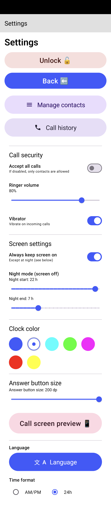
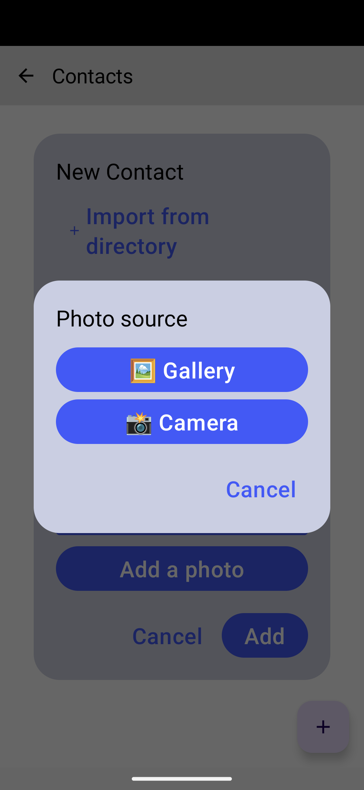
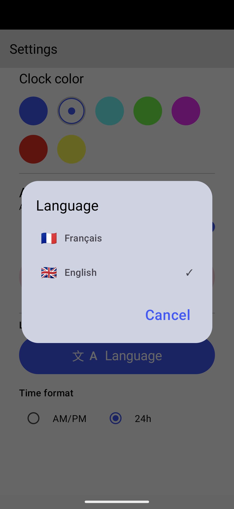

# Call Only Launcher – Minimalist & Secure Android Launcher

<p align="center">
  
</p>

Call Only Launcher is an ultra-simplified open-source Android launcher designed for elderly or vulnerable users.  
It converts an Android device into a tightly controlled phone interface focused on readability and safe incoming calls.


---

## Purpose

Call Only Launcher locks the user into a simple interface that emphasizes two primary functions:

- View the date and time with a **large, high-contrast display**
- Receive **incoming calls only** from a curated list of trusted contacts (Favorites)

Other system features (notifications, outgoing dialer, settings, system UI) are hidden or restricted to prevent confusion and accidental misuse.

---

## Key Features

- **Minimal UI**  
  Large digital clock, full date, and high-contrast theme for maximum readability.

- **Secure call handling**  
  Incoming calls ring only for contacts marked as Favorites.  
  Unknown callers can be silenced or rejected automatically.

- **Kiosk / Device Owner support**  
  When set as Device Owner, the app can:
  - Disable the status bar
  - Block system navigation gestures
  - Prevent leaving the launcher

- **Protected Admin interface**  
  Hidden admin screen to manage contacts and device state.

- **Simple PIN access**  
  Admin access is protected by a PIN (default: `1234`) for quick caregiver access.

---

## Technical Stack

- **Language**: Kotlin  
- **UI**: Jetpack Compose (Material 3)  
- **Architecture**: MVVM + Hilt  
- **Storage**: Room Database  
- **Security**:
  - `DevicePolicyManager` (Device Owner / Kiosk mode)
  - `CallScreeningService` (incoming call filtering)

---

## Screenshots

> Screenshots below use a white background.  
> A soft shadow is applied so they remain visible in light and dark modes.

### Home screen
<p align="center">
  
</p>

### Incoming call
<p align="center">
  
</p>

### Admin / PIN entry
<p align="center">
  
</p>

### Contact management
<p align="center">
  
</p>

### Settings
<p align="center">
  
</p>

### Additional screens
<p align="center">
  
  
</p>

<p align="center">
  
  
</p>

---

## Installation & Setup

### Option 1 – Download the pre-built APK (recommended)

You can download a ready-to-install APK directly from GitHub Releases:

➡️ **https://github.com/lcarne/call-only-launcher/releases**

Each release includes:
- A signed APK
- Release notes

**Steps:**
1. Download the `.apk` file from the Releases page.
2. Copy it to the target Android device.
3. Allow installation from unknown sources if prompted.
4. Install the APK.

---

### Option 2 – Build from source

1. Clone this repository.
2. Open the project in Android Studio.
3. Build and install the APK on the target device.

---

## Set as Default Launcher

After installation:
1. Press the **Home** button.
2. Select **Call Only Launcher**.
3. Choose **Always** to make it the default launcher.

---

## Enable True Kiosk Mode (Device Owner)

For full lockdown (disable status bar, navigation, system gestures), set the app as **Device Owner**.

⚠️ **Warning**  
This action is irreversible without ADB access.

### Prerequisites
- Remove Google accounts from the device (recommended)
- Enable **USB debugging** in Developer Options

### ADB command
```bash
adb shell dpm set-device-owner com.callonly.launcher/.receivers.CallOnlyAdminReceiver
```

If successful, the launcher will be pinned and the status bar/navigation will be disabled according to device policy.

## Admin Access (How to open Admin screen)

The Admin interface is intentionally hidden to prevent accidental access by the end user.

- On the home screen, long-press the date/time area for 30 seconds to open the Admin entry point.
- Enter the default PIN: `1234` (this is used for demonstration; change it in a production deployment).

From the Admin interface you can:
- Add or remove Favorites (trusted contacts).
- Temporarily unpin/unlock the device (an "Unlock" button is available in Admin Settings to exit Kiosk mode).

## Emergency Unlock / Remove Device Owner

If you cannot access the Admin unlock button, remove the Device Owner via ADB:

```bash
adb shell dpm remove-active-admin com.callonly.launcher/.receivers.CallOnlyAdminReceiver
```

## Notes & Implementation Details

- The app verifies the Admin PIN in code (`AdminViewModel` currently checks for `"1234"`).
- The Admin receiver is `com.callonly.launcher.receivers.CallOnlyAdminReceiver` and is declared in the manifest with `BIND_DEVICE_ADMIN` permission.
- Kiosk behavior (lock task packages, disabling the status bar) is controlled via `DevicePolicyManager` in `MainActivity`.

## Contributing

Contributions and corrections are welcome. Please open issues or pull requests for feature requests, fixes, or documentation updates.

## License

This project is licensed under the MIT License — see the [LICENSE](LICENSE) file.
