# Call Only Launcher – Minimalist & Secure Android Launcher

<p>
  
</p>

Call Only Launcher is a **minimalist, open-source Android launcher designed for seniors and vulnerable users**.

It transforms an Android device into a **receive-only phone**, allowing incoming calls exclusively from trusted contacts while completely disabling outgoing calls and all non-essential system features.

The goal is to provide a **calm, safe, and confusion-free experience**, while giving caregivers and family members full control over the device.

**Designed for:** Seniors • Care Facilities • Hospitals • Caregivers • Kiosk Devices


---

## Purpose

Call Only Launcher locks the user into a **single-purpose interface** focused on safety and clarity.

The user can:
- View the current date and time with a **large, high-contrast display**
- Receive **incoming calls only** from a curated list of trusted contacts (Favorites)

Everything else is intentionally hidden or restricted:
- No outgoing calls
- No notifications
- No messaging apps
- No system settings or navigation
- No accidental interactions

This design minimizes confusion and prevents misuse.

**Typical use cases include:**
- Elderly users who should not place accidental or emergency calls
- People with Alzheimer’s disease or cognitive impairment
- Patients in care facilities or hospitals
- Children or vulnerable individuals using a dedicated device
- Situations where caregivers need full control over who can call the device

---

## What this app is (and is not)

**Call Only Launcher is intentionally limited by design.**

✔ It is:
- A receive-only phone interface
- A safety-focused Android launcher
- A controlled environment for caregivers

✖ It is NOT:
- A standard phone app
- A dialer
- A messaging app
- A general-purpose launcher

---

## Key Features

- **Senior-Centric UI**  
  Large digital clock, full date, and high-contrast theme. Redesigned call screens with extra-large text, vibrant action buttons, and a reassuring visual style.

- **Intelligent Audio Routing**  
  Incoming calls start on **speakerphone by default**, helping users with hearing or dexterity challenges. Switch between speaker and earpiece using large, clear buttons.

- **Safe Call Handling**  
  - Incoming calls ring only for contacts marked as Favorites.
  - Unknown callers are **automatically silenced or rejected**.
  - **2-Tap Safety**: Hang-up and Refuse actions require two taps to prevent accidental call termination.

- **Kiosk / Device Owner Support**  
  When set as Device Owner, the app can:
  - Disable the status bar
  - Block system navigation gestures
  - Prevent leaving the launcher

- **Protected Admin Interface**  
  A hidden admin screen allows caregivers to manage contacts and device behavior without risk of accidental access.

- **Simple PIN Access**  
  Admin access is protected by a PIN (default: `1234`) for quick and controlled caregiver access.

---

## Privacy & Data

Call Only Launcher does **not collect, store, or transmit any personal data**.

- No analytics
- No tracking
- No cloud services
- No third-party integrations

All contacts, settings, and call history are stored **locally on the device only**.

---

## Technical Stack

- **Language**: Kotlin  
- **UI**: Jetpack Compose (Material 3)  
- **Architecture**: MVVM + Hilt  
- **Storage**: Room Database  
- **Security**:
  - `DevicePolicyManager` (Device Owner / Kiosk mode)
  - `CallScreeningService` (incoming call filtering)

---

## Screenshots

> Clean, high-contrast UI designed for elderly and vulnerable users.

### Home & Incoming Call

<table>
  <tr>
    <td align="center">
      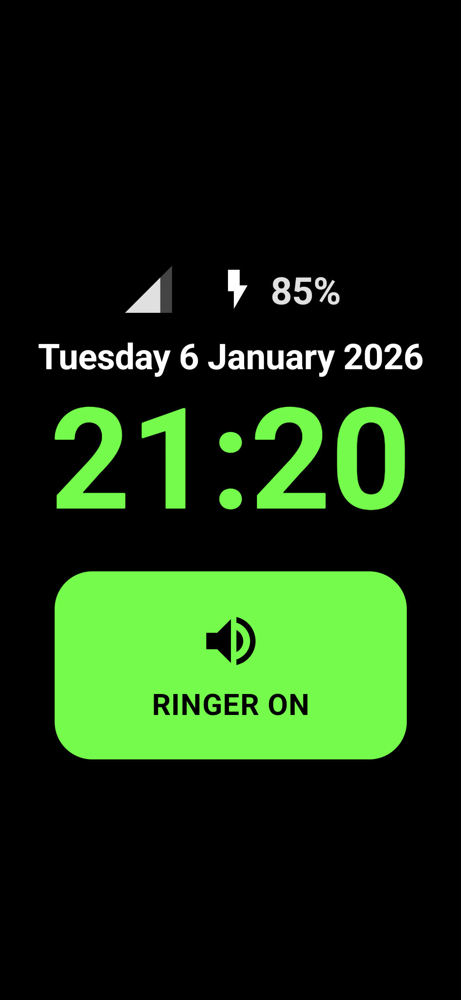<br/>
      <strong>Home screen</strong>
    </td>
    <td align="center">
      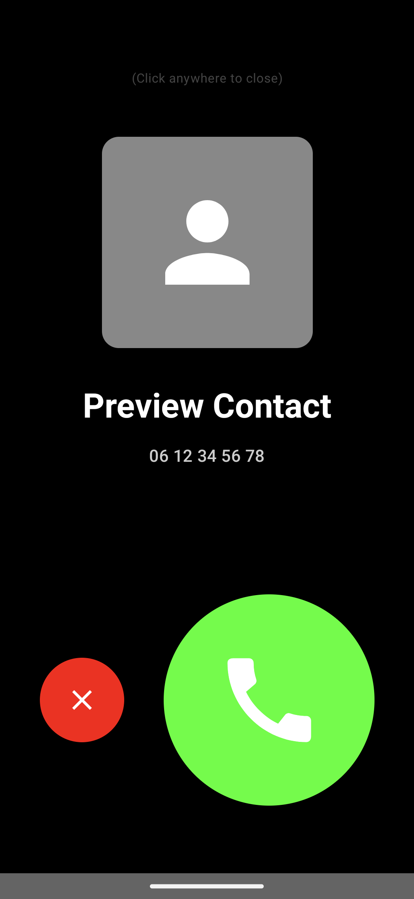<br/>
      <strong>Incoming call</strong>
    </td>
    <td align="center">
      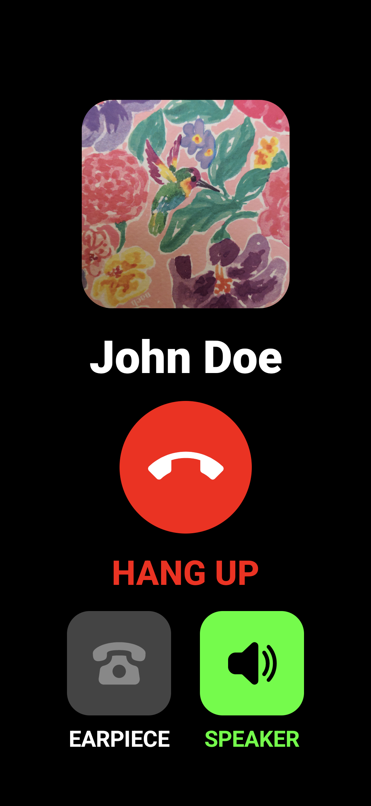<br/>
      <strong>Ongoing call</strong>
    </td>
  </tr>
</table>

---

### Admin & Contact Management

<table>
  <tr>
    <td align="center">
      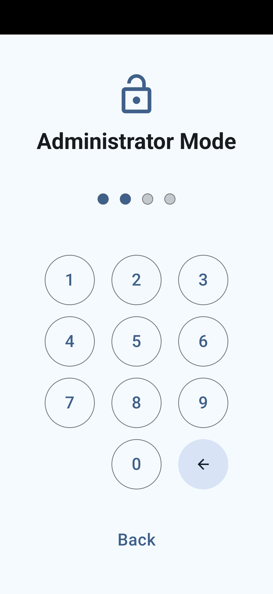<br/>
      <strong>Admin / PIN entry</strong>
    </td>
    <td align="center">
      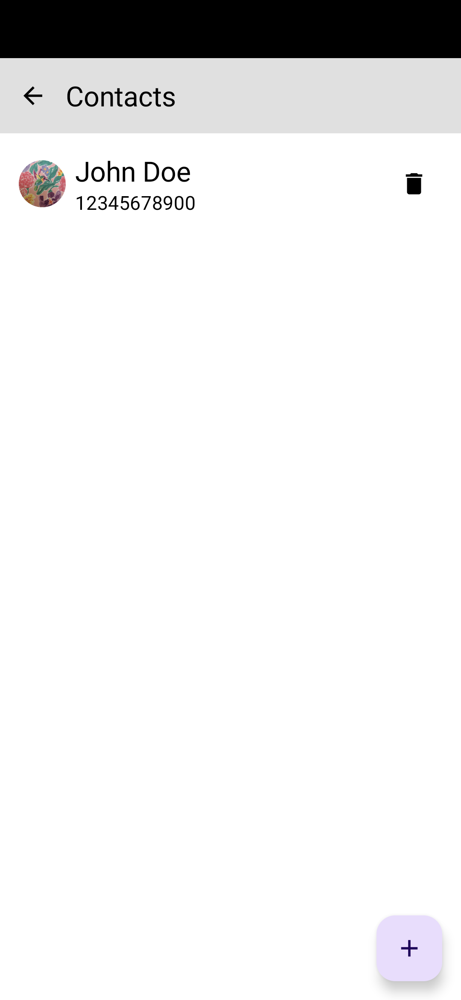<br/>
      <strong>Contacts management</strong>
    </td>
    <td align="center">
      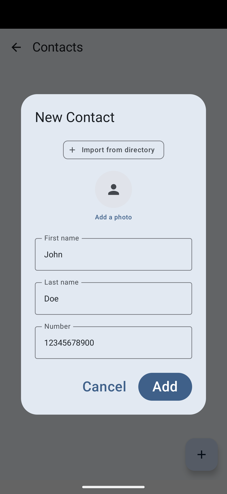<br/>
      <strong>Add contact</strong>
    </td>
  </tr>
</table>

---

### Settings

<table>
  <tr>
    <td align="center">
      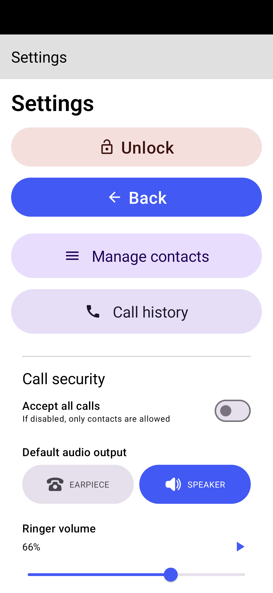<br/>
      <strong>Unlock & Call Security</strong>
    </td>
    <td align="center">
      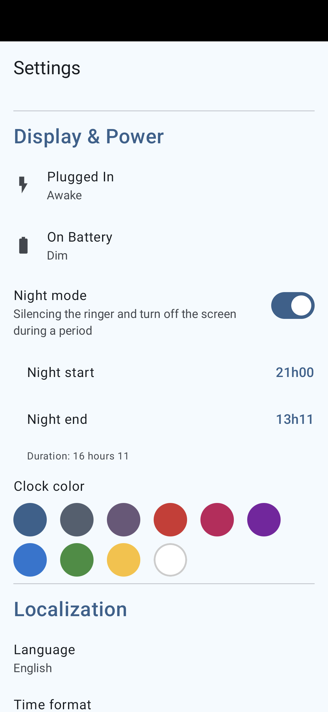<br/>
      <strong>Screen settings</strong>
    </td>
    <td align="center">
      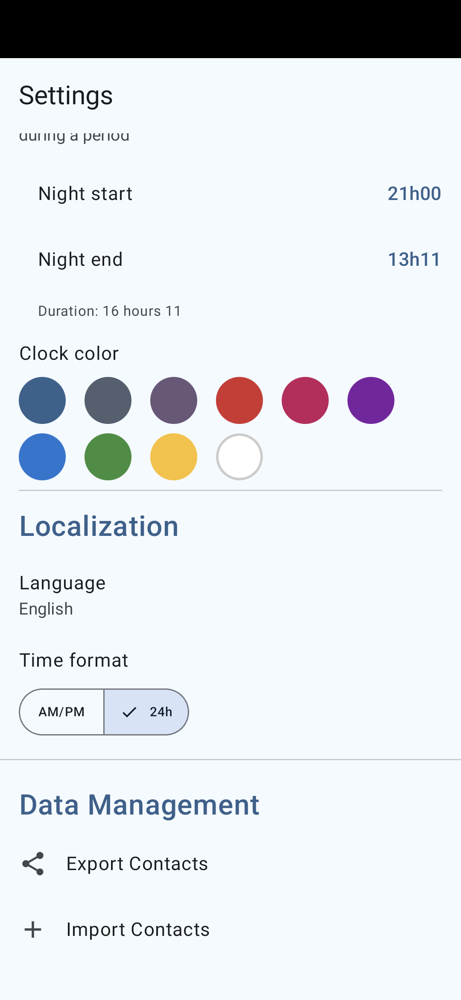<br/>
      <strong>Language & Data Management</strong>
    </td>
  </tr>
</table>

---

### Additional States

<table>
  <tr>
    <td align="center">
      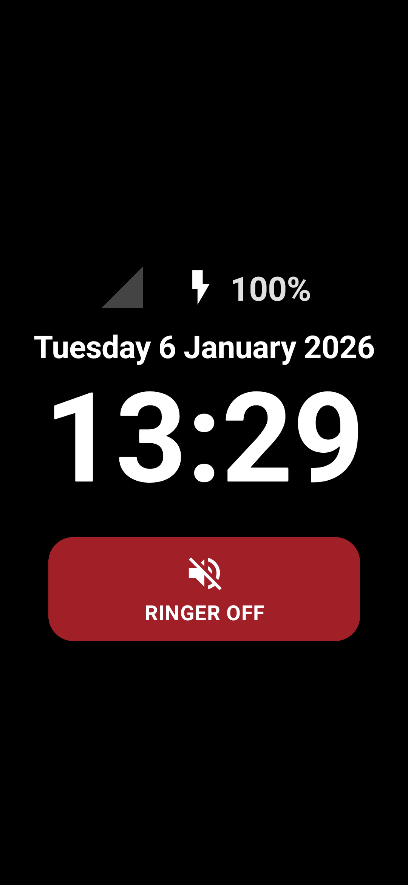<br/>
      <strong>Ringer disabled</strong>
    </td>
    <td align="center">
      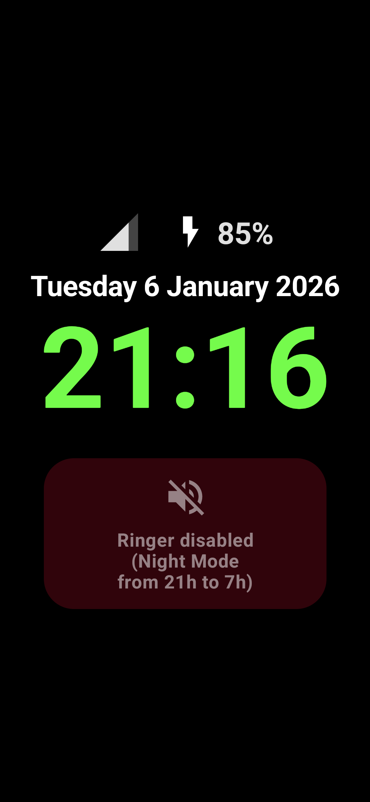<br/>
      <strong>Night mode</strong>
    </td>
    <td align="center">
      <br/>
      <strong>Dim mode</strong>
    </td>
  </tr>
</table>

---

## Installation & Setup

### Option 1 – Download the pre-built APK (recommended)

You can download a ready-to-install APK from GitHub Releases:

➡️ https://github.com/lcarne/call-only-launcher/releases

Each release includes:
- A signed APK
- Release notes

**Steps:**
1. Download the `.apk` file from the Releases page.
2. Copy it to the target Android device.
3. Allow installation from unknown sources if prompted.
4. Install the APK.

---

### Option 2 – Build from source

1. Clone this repository.
2. Open the project in Android Studio.
3. Build and install the APK on the target device.

---

## Set as Default Launcher

After installation:
1. Press the **Home** button.
2. Select **Call Only Launcher**.
3. Choose **Always** to make it the default launcher.

---

## Enable True Kiosk Mode (Device Owner)

For full lockdown (disable status bar, navigation, system gestures), set the app as **Device Owner**.

⚠️ **Warning**  
This action is irreversible without ADB access.

### Prerequisites
- Remove Google accounts from the device (recommended)
- Enable **USB debugging** in Developer Options

### ADB command

```bash
adb shell dpm set-device-owner com.callonly.launcher/.receivers.CallOnlyAdminReceiver

```

If successful, the launcher will be pinned and the status bar/navigation will be disabled according to device policy.

## Admin Access (How to open Admin screen)

The Admin interface is intentionally hidden to prevent accidental access by the end user.

- On the home screen, **tap the date/time area 15 times rapidly** to open the Admin entry point.
- Enter the default PIN: `1234` (The default PIN is hardcoded for simplicity. Feel free to adjust it in the source code and build your own version).

From the Admin interface you can:
- Add or remove Favorites (trusted contacts).
- Configure screen behavior dependent on power state (Plugged In vs On Battery):
  - **Off**: Standard Android timeout.
  - **Dim**: Screen stays on with reduced brightness, showing only the clock (in soothing #B4BEB0 color).
  - **Awake**: Screen stays on at normal brightness.
- Configure Night mode, Clock color, Ringer volume.
- Temporarily unpin/unlock the device (an "Unlock" button is available in Admin Settings to exit Kiosk mode).
- Set app as Default Launcher via a dedicated prompt if not already set.

## Emergency Unlock / Remove Device Owner

If you cannot access the Admin unlock button, remove the Device Owner via ADB:

```bash
adb shell dpm remove-active-admin com.callonly.launcher/.receivers.CallOnlyAdminReceiver
```

## Notes & Implementation Details

- The app verifies the Admin PIN in code (`AdminViewModel` currently checks for `"1234"`).
- The Admin receiver is `com.callonly.launcher.receivers.CallOnlyAdminReceiver` and is declared in the manifest with `BIND_DEVICE_ADMIN` permission.
- Kiosk behavior (lock task packages, disabling the status bar) is controlled via `DevicePolicyManager` in `MainActivity`.

## Contributing

Contributions and corrections are welcome. Please open issues or pull requests for feature requests, fixes, or documentation updates.

## License

This project is licensed under the MIT License, see the [LICENSE](LICENSE) file.
